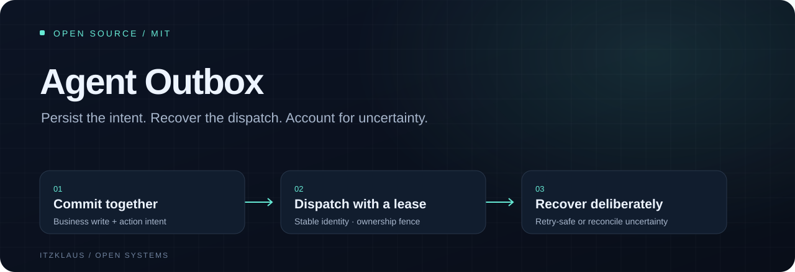

# Agent Outbox



[](https://github.com/itzKLAUS/agent-outbox/actions/workflows/check.yml) · [MIT](LICENSE) · [Release notes](CHANGELOG.md) · [Sponsor](https://github.com/sponsors/itzKLAUS)

## Install in your application

Python 3.11+. This release is available from GitHub; it is not claimed to be published on PyPI.

```sh
python -m pip install "git+https://github.com/itzKLAUS/agent-outbox.git@v0.2.0"
```

For development, clone the repository, enter its directory and use the locked commands below.

**Keep a business write and its intended agent action together, then recover dispatch safely.**

When an automation worker crashes, a database update can survive while its tool call disappears. The reverse is equally troublesome: a tool may commit externally while its acknowledgement is lost. Agent Outbox puts the intent in the same SQLite transaction as the business write and distinguishes actions that can safely be retried from actions whose uncertain outcome must be reconciled.

This model-independent Python library implements durable dispatch, bounded attempts, worker leases, local fencing and explicit uncertain-outcome handling. It has no runtime dependencies, model subscription or external service requirement. It is an initial implementation; it is not independently audited or established as enterprise-ready.

## Implemented behavior

- Caller-owned transaction for atomic business-write and enqueue persistence.
- Scoped idempotency keys; changed operation, target, payload or delivery policy is rejected.
- Serialized claims across threads and local processes sharing one durable database.
- Random ownership tokens and increasing fences reject stale completion and renewal.
- Stable downstream idempotency key across retries, deadlines and attempt limits.
- Conservative `once` delivery: ambiguous failures and expired leases become `uncertain`.
- `retry_safe` delivery for adapters backed by actual downstream deduplication.
- Lease renewal, cancellation of pending intents, and explicit operator reconciliation.
- Ordered, paginated events and metadata exports that omit payloads, lease tokens and raw results.
- Strict finite JSON payloads, size bounds, parameter validation and typed distribution.

## Operational recovery

`box.counts()` and `box.find("uncertain", limit=100)` give operators bounded metadata views. `box.backup("new-snapshot.sqlite")` creates a consistent online snapshot and refuses overwrites. Restore with dispatch disabled and reconcile downstream effects before enabling workers.

## Run it

Python 3.11 or later and uv are required.

```sh
uv sync --locked
uv run python examples/demo.py
uv run ruff check .
uv run ruff format --check .
uv run mypy src
uv run pytest --cov=agent_outbox --cov-fail-under=90
uv build --no-sources
```

The synthetic demo commits a report and publish intent together. One worker simulates a crash after a fake downstream write; a new worker reclaims the intent with a higher fence and the same idempotency key. The fake service returns the existing receipt. There is one downstream write and a completed intent.

## Integrate a trusted adapter

```python
import time
from agent_outbox import Outbox, Worker

box = Outbox("application.sqlite")
with box.connect() as conn:
    conn.execute("BEGIN IMMEDIATE")
    try:
        # Perform the application's business write using this SAME connection.
        intent_id = box.enqueue(
            conn,
            scope="tenant-1",
            key="report-123",
            operation="report.publish",
            target="reports",
            payload={"report_id": "123"},
            mode="once",
            expires_ms=time.time_ns() // 1_000_000 + 60_000,
        )
        conn.commit()
    except BaseException:
        conn.rollback()
        raise


def adapter(lease):
    # Resolve operation and target against a trusted adapter allowlist.
    # Invoke your actual tool here. Use lease.idempotency_key when the tool
    # has a durable deduplication contract; only then opt into retry_safe.
    return {"synthetic_receipt": lease.intent_id}


Worker(box, "worker-1", adapter).step()
```

See [related work](docs/ALTERNATIVES.md), [integration](docs/INTEGRATION.md), [state transitions](docs/STATE_MACHINE.md), [operations](docs/OPERATIONS.md), [trust boundaries](docs/THREAT_MODEL.md) and [verification](docs/VERIFICATION.md).

## Recovery boundary

Local fences protect ledger updates. They cannot stop an old worker's already running external request. Exactly-once external effects require the destination to durably deduplicate the stable intent ID, or enforce a fence itself. Marking an action `retry_safe` is an integration assertion, not a capability supplied by this package.

For a non-idempotent tool, `once` prevents automatic retries after a claim becomes ambiguous; it does not prove whether the tool ran. Resolve an uncertain intent only after checking independent downstream evidence. A crashed worker that never reached the tool can still require reconciliation. There is deliberately no automatic redrive of uncertain non-idempotent actions.

Licensed under [MIT](LICENSE). See [contributing](CONTRIBUTING.md), [support](SUPPORT.md) and [security reporting](SECURITY.md).
